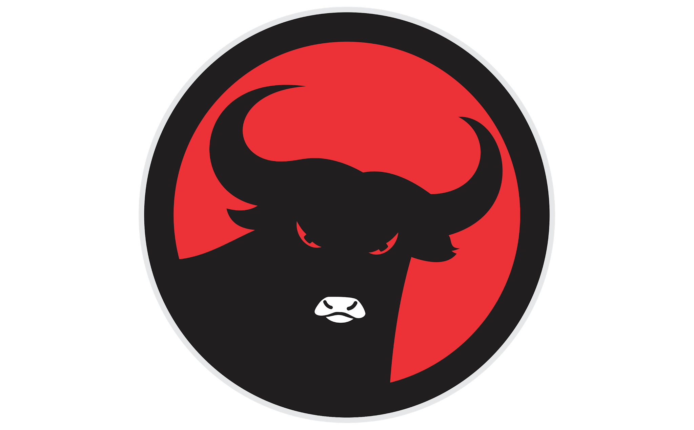

<div align="center">



# 🎓 2B Teknik Informatika
## Universitas Islam Balitar

### Modern • Responsive • Interactive • Student Community Website

<p align="center">


</p>

---

### 🌐 Website Resmi Kelas 2B Teknik Informatika
### Fakultas Teknologi Informasi
### Universitas Islam Balitar

*"Belajar, Berkarya, dan Berinovasi Bersama."*

</div>

---

# 📖 Tentang Website

Website ini merupakan **website resmi Kelas 2B Teknik Informatika Universitas Islam Balitar** yang dikembangkan sebagai media informasi digital, dokumentasi kegiatan, dan sarana komunikasi bagi seluruh mahasiswa kelas.

Website ini dirancang dengan konsep **Modern Academic**, menggabungkan tampilan yang bersih, animasi yang halus, serta pengalaman pengguna yang nyaman di berbagai perangkat.

Selain sebagai media informasi, website ini juga menjadi representasi digital identitas kelas yang dapat digunakan untuk keperluan akademik maupun dokumentasi.

---

# ✨ Fitur Utama

- 🏠 Landing Page Modern
- 🎨 Glassmorphism UI
- 📱 Responsive Design
- ⚡ Fast Performance
- 🎞️ Smooth Animation
- 🖱️ Micro Interaction
- 🌙 Sticky Navigation
- 📅 Jadwal Perkuliahan
- 🖼️ Galeri Kegiatan
- 👨‍🎓 Data Anggota Kelas
- 📞 Informasi Kontak
- 🚀 Scroll Animation
- ⬆️ Back To Top Button
- 📊 Scroll Progress Indicator
- 🎯 Active Navigation
- 💙 Modern Color Palette

---

# 🖥️ Tampilan Website

## Home

- Hero Section
- Logo Kelas
- Animasi Coding GIF
- Call To Action
- Smooth Scroll

---

## Tentang Kelas

- Profil Kelas
- Statistik
- Glass Card
- Background Foto Bersama

---

## Jadwal

- Jadwal Mata Kuliah
- Card Responsive
- Hover Animation

---

## Galeri

- Dokumentasi Kegiatan
- Hover Zoom
- Responsive Grid

---

## Anggota

- Data Mahasiswa
- Search
- Card Animation

---

## Kontak

- Email
- WhatsApp
- Instagram
- Lokasi Kampus

---

# 🎨 Desain

Website menggunakan konsep

- Modern Academic
- Clean UI
- Minimalist
- Developer Style
- Glassmorphism
- Soft Shadow
- Rounded Corner
- Gradient Background
- Blur Effect
- Responsive Layout

---

# 🚀 Teknologi

| Teknologi | Digunakan |
|------------|-----------|
| React JS | ✅ |
| Vite | ✅ |
| Tailwind CSS v3 | ✅ |
| React Router DOM | ✅ |
| Framer Motion | ✅ |
| Lucide React | ✅ |
| React Scroll | ✅ |

---

# 📂 Struktur Project

```text
2B-Teknik-Informatika/
│
├── public/
│
├── src/
│   │
│   ├── assets/
│   │   ├── logo.png
│   │   ├── coding.gif
│   │   └── fotokelas.png
│   │
│   ├── components/
│   │   ├── Navbar.jsx
│   │   ├── Hero.jsx
│   │   ├── About.jsx
│   │   ├── Schedule.jsx
│   │   ├── Gallery.jsx
│   │   ├── Members.jsx
│   │   ├── Contact.jsx
│   │   ├── Footer.jsx
│   │   ├── BackToTop.jsx
│   │   └── ScrollProgress.jsx
│   │
│   ├── pages/
│   │
│   ├── App.jsx
│   ├── main.jsx
│   └── index.css
│
├── package.json
├── vite.config.js
└── README.md
```

---

# 📦 Instalasi

Clone repository

```bash
git clone https://github.com/username/2b-teknik-informatika.git
```

Masuk folder project

```bash
cd 2b-teknik-informatika
```

Install dependency

```bash
npm install
```

Menjalankan project

```bash
npm run dev
```

Build Production

```bash
npm run build
```

Preview

```bash
npm run preview
```

---

# 🎯 Responsive

Website telah dioptimalkan untuk

- 📱 Mobile
- 📲 Tablet
- 💻 Laptop
- 🖥️ Desktop

---

# 🎬 Animasi

Website menggunakan berbagai animasi modern seperti

- Fade Animation
- Slide Animation
- Floating Animation
- Scroll Reveal
- Hover Effect
- Scale Animation
- Card Lift
- Glass Blur
- Smooth Transition
- Button Ripple
- Active Navigation
- Scroll Progress

---

# 🎨 Color Palette

| Warna | Hex |
|--------|------|
| Primary | `#2563EB` |
| Secondary | `#38BDF8` |
| Accent | `#06B6D4` |
| Background | `#F8FAFC` |
| Text | `#0F172A` |

---

# 🖼️ Assets

| Asset | Fungsi |
|---------|---------|
| logo.png | Logo Website |
| coding.gif | Hero Illustration |
| fotokelas.png | Background Section |

---

# 📈 Performance

Target performa website

- ⚡ Fast Loading
- 💯 Responsive
- ♿ Accessible
- 🔍 SEO Friendly
- 📱 Mobile Friendly
- 🚀 Optimized Build

---

# 👨‍💻 Developer

**Kelas 2B Teknik Informatika**

Universitas Islam Balitar

---

# 🎓 Motto

> **"Belajar Bersama, Berkarya Nyata, Menginspirasi Dunia Digital."**

---

# 💙 Terima Kasih

Terima kasih kepada seluruh mahasiswa **2B Teknik Informatika Universitas Islam Balitar** yang telah berkontribusi dalam membangun semangat belajar, kolaborasi, dan inovasi.

Semoga website ini dapat menjadi media informasi yang bermanfaat serta menjadi dokumentasi perjalanan dan kebersamaan selama menempuh pendidikan.

---

<div align="center">

## ⭐ Jika proyek ini bermanfaat, jangan lupa berikan Star pada repository ini!

**Made with ❤️ by 2B Teknik Informatika — Universitas Islam Balitar**

© 2026 All Rights Reserved.

</div>